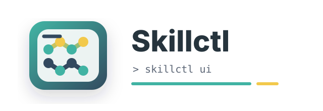

<p align="center">
  
</p>

<h1 align="center">⚡ Skillctl</h1>

<p align="center">
  <strong>A local-first macOS app and CLI for managing Agent Skills from Git repositories and local folders.</strong>
</p>

<p align="center">
  <a href="README.zh-CN.md">中文</a>
  ·
  <a href="https://github.com/nxZhai/Skill-Ctl/releases">Releases</a>
</p>

<p align="center">
  <a href="https://github.com/nxZhai/Skill-Ctl/releases"></a>
  <a href="https://github.com/nxZhai/Skill-Ctl/actions/workflows/ci.yml"></a>
  
  
  
  
</p>

## ✨ Features

- **Source management**: add GitHub, Git-compatible, or local sources, then sync or rescan them as appropriate.
- **Recursive skill discovery**: scan repositories for `SKILL.md` files and track each skill's source, path, description, tags, and activation state.
- **Local skill inventory**: inspect existing Claude Code or Codex skill folders so Skillctl reflects what agents can already see.
- **Search and filters**: filter skills by keyword, source, tag, agent, and enabled state.
- **Tags and notes**: add repository/skill tags and personal notes to keep large skill libraries navigable.
- **Batch operations**: select multiple skills to add/remove tags or enable them in bulk.
- **Global and project activation**: enable skills globally or into a project-local agent directory.
- **Symlink deployment**: deploy skills through managed symlinks instead of copying source files.
- **Project manifests**: generate and apply project-level `.skillctl.toml` manifests.
- **Usage ranking**: summarize observed skill usage from local Codex/agent history.
- **Doctor checks**: inspect Git availability, source checkouts, local changes, broken symlinks, and manifest references.
- **Single-binary local app**: run a local token-protected HTTP server with the Vite frontend embedded in the Go binary.

## 🧭 Core Concepts

```text
Git repo is the sync/update unit
Skill is the browse/filter/enable unit
Symlink is the deployment mechanism
```

Skillctl keeps source repositories separate from activation targets. Repositories are cloned under local data storage, discovered skills are indexed in SQLite, and enabled skills are exposed to agents through controlled symlinks.

## 🚀 Commands

```bash
skillctl ui
skillctl headless
skillctl doctor
skillctl rescan [source-id]
skillctl update [--check]
skillctl uninstall
skillctl version
```

`skillctl ui` initializes local config/data directories, starts an HTTP server on `127.0.0.1` with a random token, and opens the browser.

`skillctl headless` starts the same token-protected API without serving the embedded frontend or opening a browser. It prints an API URL and blocks until interrupted, making it suitable for CLI and automation workflows.

For an interactive session, start with `skillctl ui`. For scripts or API clients, use `skillctl headless`; both modes keep the server on `127.0.0.1` and print the token-protected endpoint at startup.

## 📦 Install

### From a GitHub Release

Download the archive for your Mac from [Releases](https://github.com/nxZhai/Skill-Ctl/releases): use `darwin_arm64` for Apple Silicon and `darwin_amd64` for Intel Macs. Extract it, then place the binary in a directory on your `PATH`:

```bash
tar -xzf skillctl_<version>_darwin_arm64.tar.gz
mkdir -p ~/.local/bin
install -m 755 skillctl_<version>_darwin_arm64/skillctl ~/.local/bin/skillctl
```

If `~/.local/bin` is not already in your shell `PATH`, add this to `~/.zshrc`:

```bash
export PATH="$HOME/.local/bin:$PATH"
```

Verify the installation:

```bash
skillctl version
skillctl ui
```

### From a source checkout

Install the embedded `skillctl` binary to `~/.local/bin`:

```bash
./scripts/install-local.sh
```

To install somewhere else, pass `PREFIX`:

```bash
PREFIX=/usr/local ./scripts/install-local.sh
```

## 🔄 Updating

Check whether a newer compatible GitHub Release is available:

```bash
skillctl update --check
```

Download and install the latest compatible Release:

```bash
skillctl update
```

Before replacing its own binary, Skillctl creates a compressed backup under `~/.cache/skillctl/backups/` containing its configuration, SQLite state, managed repositories, and unified skill links. It validates the Release asset's SHA-256 when GitHub provides one, then hashes the same user data before and after the update. If the data differs, the command fails and leaves the backup in place; it does not automatically restore data. Starting `skillctl ui` also makes a best-effort release check and prints a terminal notice when a newer version is available.

For a source checkout used in development, update the checkout and reinstall it with:

```bash
./scripts/update-local.sh
```

## 🗑️ Uninstall

```bash
skillctl uninstall
```

Uninstall first removes every Skillctl-recorded agent skill symlink, with the same target validation used by the UI. It then asks whether to delete Skillctl-managed local skill repositories and finally removes the running `skillctl` binary. Choosing no keeps the repositories, configuration, SQLite state, and cache for a future reinstall. If a managed link cannot be validated or removed safely, uninstall stops without deleting the binary.

## 🗜️ Packaging

Create macOS `arm64` and `amd64` release archives under `dist/`:

```bash
./scripts/package-macos.sh
```

Set `VERSION` to override the version used in archive names:

```bash
VERSION=0.6.1 ./scripts/package-macos.sh
```

## 🛠️ Development

Build the frontend first so Go can embed `web/dist`:

```bash
cd web
npm install
npm run build
cd ..
go build -o skillctl ./cmd/skillctl
```

Run checks:

```bash
go test ./...
npm --prefix web run build
```

## 🗂️ Local Data

By default, Skillctl uses:

```text
~/.config/skillctl/
~/.local/share/skillctl/
~/.cache/skillctl/
```

Git repositories are cloned under `~/.local/share/skillctl/repos/`; unified skill symlink entries are created under `~/.local/share/skillctl/skills/`. Both storage directories can be changed in Settings. The initial agent targets are `~/.agents/skills` and `~/.claude/skills` for global activation, with `.agents/skills` and `.claude/skills` for project activation.

## 🔒 Safety

Skillctl only creates symlinks, refuses to overwrite ordinary files or foreign symlinks, and deletes only activation links recorded in SQLite. A source sync stops when that source has local changes; it uses fast-forward-only Git updates and never resets a source checkout.

Git synchronization uses `fetch --prune` and `merge --ff-only`; it does not run `git reset --hard`. The local UI and headless API listen only on `127.0.0.1`, and all API requests must include the random token generated at startup.
